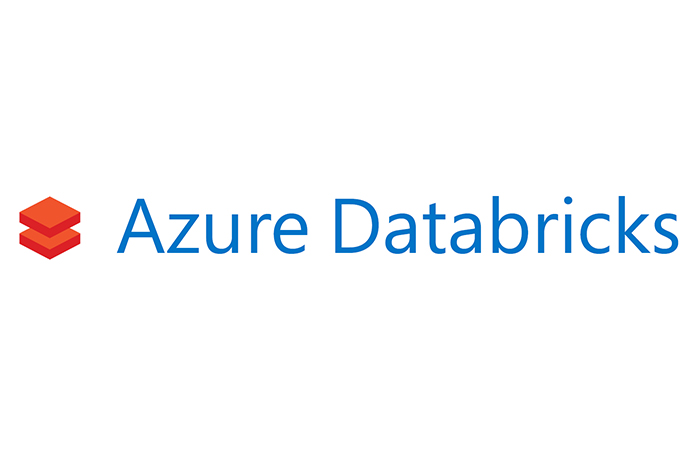

# Azure-Databricks-Labs

This lab gives the hands-on experience with the Databricks CLI.

## Pre-Requisites
This lab expects you to have a working Python installation either on your Desktop alternatively you can simply use the Data Science Virtual Machine (DSVM) or any tier in Azure.

## Install Databricks CLI

1. Open command prompt in your VM
2. Run below command
    `pip install databricks-cli`

## Generate the token to interact with Databricks cluster using Databricks-CLI

1. Log into your Azure Portal 
2. Select your Databricks resource 
3. Click the **Launch Workspace**
4. Once you login to the workspace you will find the **person icon** on the top-right side of the page
5. Click the  **Person Icon** and select **User Settings**
6. Click **Generate New Token** and key in the **Comment** and **Lifetime**, ensure that you **copy the token key in a secure place** and store it for future use

## Connect to Databricks from CLI

1. Run below command
    ` databricks configure --token `
2. Log into your Azure Portal 
3. Select your Databricks resource
4. Under the overview section copy the URL ( for e.g., https://******.azuredatabricks.net )
5. When it will prompt to enter **Databricks Host (should begin with https://):**, Please enter the URL you copied previously
6. It will prompt for token
7. Paste the token created previously
8. Run the command **databricks workspace ls** and you must see atleast two folders like Users and Shared

*Note: You can use multiple profiles to connect to various Databricks workspaces from the same Databricks CLI*

## Get familiarity with commands

1. List the files under your workspace - replace the exmaple below with your username and your company with your company name for Databricks workspace
    **databricks workspace ls /Users/example@yourcompany.com**
2. List the databricks clusters
    **databricks clusters list**
3. List the runtime versions of the spark clusters    
    **databricks clusters spark-versions**
4. DBFS commands: List the files in DBFS
    **databricks fs ls**
5. DBFS Commands: Copy the local files into DBFS
    **dbfs cp <Path to Local file>/test.txt dbfs:/test.txt**

